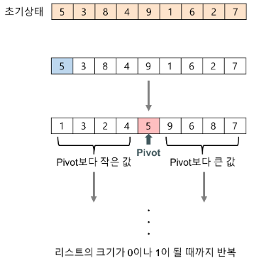

### 퀵소트 

---

#### 개념 요약

* 퀵 정렬은 불안정 정렬에 속하며, 다른 원와의 비교만으로 정렬을 수행하는 비교 정렬에 손한다. 

* 피봇을 어디에 두냐에 따라 여러가지 알고리즘이 존재한다.
    * [안정 / 불안정 정렬]( https://godgod732.tistory.com/10 )
* 분할 정복 알고리즘의 하나 (문제를 작은 2개의 문제로 분리하고 각각을 해결하고 겨로가를 모은다.)

#### 과정

1. 리스트 안에 있는 한 요소를 선택한다. 이렇게 고른 원소를 피봇(pivot) 이라고 한다.
2. 피봇을 기준으로 피봇보다 작은 요소들은 모두 피벗의 왼쪽으로 옮겨지고 피벗보다 큰요소들은 모두 피벗의 오른쪽으로 옮겨진다.
3. 피봇을 제외한 왼쪽 리스트와 오른쪾 리스트를 다시 정렬한다 . (분할 정복)
   * 분할된 부분에 대해서는 순환 호출 , 혹은 다시 퀵정렬 한다.
4. 부분 리스트들이 더 이상 분할이 불가능 할 때까지 반복한다. (리스트의 크기나 0 or 1이 될때까지)
   * 

#### 종류 

* 피봇 맨 오른쪽 

* ~~~
    void QuickSort(int a[], int start, int end)
    {
    	int index ; //사용할 로컬 변수들 선언 index는 partrition이 이루어진 위치 추적
    	int i ; //for debug
    	if(start < end) //start 인덱스가 end 인덱스보다 적으면 아직 정렬 할 element들이 남아 있으므로 계속 진행하고, element 가 하나 남았을때 재귀 조건 종료
    	{
    		Partirion(A, start, end) ; //누구를 기준으로 줄세웠는지 인덱스를 리턴
    		QuickSort(A, start, index-1) ; // 인덱스를 중심으로 왼쪽 element 들을 다시 정렬 시도		
    		QuickSort(A, index+1, end) ; //index를 중심으로 오른쪽 element들을 다시 정렬
    	}
    
    	return ; //element가 하나 남았으니 더이상 정렬시도 할 필요없으지 재귀조건 종료
    	
    }
    
    int Partition(int a[], int start, int end) 
    {
    	int pivot = A[end] ;
    	int i ;
    	int index = start ;
    	
    	int temp ;
    	
    	for(i=start ; i<end ; i++)
    	{
    		if(A[i] <= pivot) 
    		{//피봇보다 작은것들을 앞쪽으로 옮긴다.
                temp = A[i] ;
                A[i] = A[index] ;
                A[index] = temp ;
                index++ ;
    		}
    	}
    	
    	temp = A[index] ; //인덱스와 피봇의 위치를 바꾼다. 
    	A[index] = A[end] ;
    	return index ;
    }
    
    
    ~~~